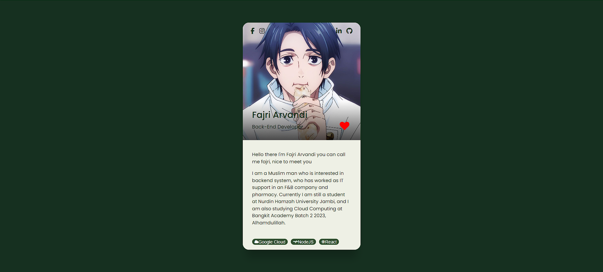

# Virtual Card with React

Preview:

Let's try this code:
<ol>
    <li>Download or clone this project</li>
    <li>Make sure you have installed Node Package Manager and NodeJS</li>
    <li>Install package with "npm install"</li>
    <li>Adjust your data in file src/data.js</li>
    <li>Run this project with "npm run dev"</li>
    <li>Happy coding</li>
</ol>